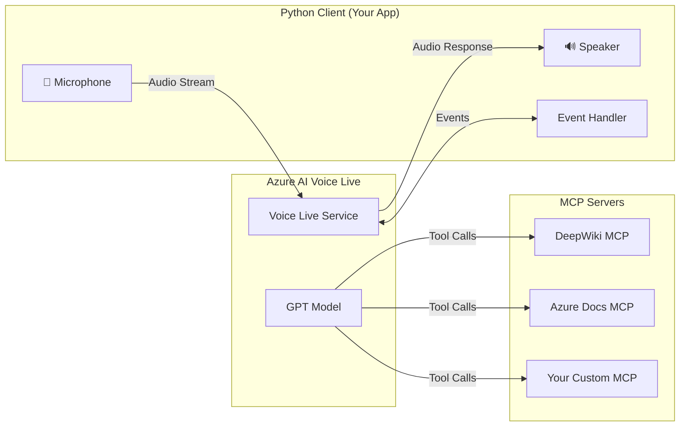

# Setting Up a Python Voice Assistant with Azure AI Voice Live + MCP

This guide walks you through configuring and deploying a **Python voice assistant** that integrates with **Azure AI Voice Live** and **Model Context Protocol (MCP)** servers. The assistant can discover and invoke tools hosted on remote MCP servers (e.g., documentation search, wiki lookup, custom APIs) and incorporate tool results into spoken responses.

---

## Table of Contents

1. [Architecture Overview](#architecture-overview)
2. [Prerequisites](#prerequisites)
3. [Step 1: Azure Resource Setup](#step-1-azure-resource-setup)
4. [Step 2: Environment Setup](#step-2-environment-setup)
5. [Step 3: Install Dependencies](#step-3-install-dependencies)
6. [Step 4: Configure Authentication](#step-4-configure-authentication)
7. [Step 5: Define MCP Servers](#step-5-define-mcp-servers)
8. [Step 6: Configure the Voice Session](#step-6-configure-the-voice-session)
9. [Step 7: Handle MCP Events](#step-7-handle-mcp-events)
10. [Step 8: Handle Approval Flows](#step-8-handle-approval-flows)
11. [Step 9: Handle Stall Detection](#step-9-handle-stall-detection)
12. [Step 10: Run the Application](#step-10-run-the-application)
13. [MCP Server Configuration Reference](#mcp-server-configuration-reference)
14. [Best Practices](#best-practices)
15. [Troubleshooting](#troubleshooting)

---

## Architecture Overview



### How MCP Differs from Function Calling

| Aspect | Function Calling | MCP Server |
|---|---|---|
| **Tool execution** | Client-side | Server-side (managed by Voice Live) |
| **Tool discovery** | Client defines tools explicitly | Voice Live auto-discovers tools from MCP endpoint |
| **Approval model** | Not applicable | Configurable: `"always"` (default), `"never"`, or per-tool dictionary |
| **API version required** | `2025-10-01` | `2026-01-01-preview` or later |

---

## Prerequisites

Before you begin, ensure you have:

> [!IMPORTANT]
> All of these prerequisites must be satisfied before proceeding.

- [ ] **Azure subscription** — [Create one for free](https://azure.microsoft.com/free/)
- [ ] **Python 3.10 or later** — Check with `python3 --version`
- [ ] **Microsoft Foundry resource** — Created in a [supported region](https://learn.microsoft.com/azure/ai-services/speech-service/regions)
- [ ] **`azure-ai-voicelive` package** — Version **1.0.0b5 or later** (MCP requires `api_version="2026-01-01-preview"`)
- [ ] **Cognitive Services User role** — Assigned to your user account in the Azure portal under **Access control (IAM) > Add role assignment**
- [ ] **Working microphone and speakers** — The app uses PyAudio for real-time audio I/O

> [!TIP]
> You do **NOT** need to deploy an audio model manually. Voice Live is fully managed — the model is automatically deployed for you.

---

## Step 1: Azure Resource Setup

### 1.1 Create a Microsoft Foundry Resource

1. Go to the [Azure Portal](https://portal.azure.com)
2. Search for **"Azure AI Services"** or **"Microsoft Foundry"**
3. Click **Create** and select a supported region
4. Note down your **endpoint URL** — it will look like:
   ```
   https://your-resource-name.services.ai.azure.com/
   ```

### 1.2 Assign the Required Role

1. Navigate to your Foundry resource in Azure Portal
2. Go to **Access control (IAM)** → **Add role assignment**
3. Assign the **Cognitive Services User** role to your user account

### 1.3 Get Your API Key (optional)

1. In your Foundry resource, go to **Keys and Endpoint**
2. Copy **Key 1** or **Key 2**

> [!TIP]
> You can use either an **API key** or **Azure CLI token credential** for authentication. Token credential is recommended for production.

---

## Step 2: Environment Setup

### 2.1 Create Your Project Directory

```bash
mkdir voice-assistant-mcp
cd voice-assistant-mcp
```

### 2.2 Create a Virtual Environment

```bash
python3 -m venv .venv
source .venv/bin/activate   # macOS/Linux
# .venv\Scripts\activate    # Windows
```

### 2.3 Create Environment Variables File

Create a `.env` file in your project root:

```env
# Required
AZURE_VOICELIVE_ENDPOINT=https://your-resource-name.services.ai.azure.com/

# Choose ONE authentication method:
# Option A: API Key
AZURE_VOICELIVE_API_KEY=your-api-key-here

# Option B: Token Credential (use --use-token-credential flag instead)

# Optional overrides
AZURE_VOICELIVE_MODEL=gpt-realtime
AZURE_VOICELIVE_VOICE=en-US-Ava:DragonHDLatestNeural
```

> [!WARNING]
> Never commit your `.env` file to version control. Add it to `.gitignore`.

---

## Step 3: Install Dependencies

```bash
pip install azure-ai-voicelive python-dotenv pyaudio azure-identity
```

### Package Breakdown

| Package | Purpose |
|---|---|
| `azure-ai-voicelive` | Core SDK for Voice Live (v1.0.0b5+ required for MCP) |
| `python-dotenv` | Load environment variables from `.env` file |
| `pyaudio` | Real-time audio capture (microphone) and playback (speaker) |
| `azure-identity` | Azure CLI credential authentication (optional, for token-based auth) |

> [!NOTE]
> **macOS users**: If `pyaudio` fails to install, first install PortAudio:
> ```bash
> brew install portaudio
> pip install pyaudio
> ```
>
> **Linux users**:
> ```bash
> sudo apt-get install portaudio19-dev python3-pyaudio
> pip install pyaudio
> ```

---

## Step 4: Configure Authentication

You have two authentication options:

### Option A: API Key Authentication

```python
from azure.core.credentials import AzureKeyCredential

credential = AzureKeyCredential("your-api-key-here")
```

### Option B: Azure CLI Token Credential (Recommended for Production)

First, sign in to Azure:
```bash
az login
```

Then in your code:
```python
from azure.identity.aio import AzureCliCredential

credential = AzureCliCredential()
```

---

## Step 5: Define MCP Servers

This is the core of the MCP integration. You define which remote MCP servers Voice Live can access during the session.

```python
from azure.ai.voicelive.models import MCPServer, Tool

mcp_tools: list[Tool] = [
    # Server 1: Auto-execute tools (no approval needed)
    MCPServer(
        server_label="deepwiki",
        server_url="https://mcp.deepwiki.com/mcp",
        allowed_tools=["read_wiki_structure", "ask_question"],
        require_approval="never",
    ),
    # Server 2: Requires user approval before each tool call
    MCPServer(
        server_label="azure_doc",
        server_url="https://learn.microsoft.com/api/mcp",
        require_approval="always",
    ),
    # Server 3: Per-tool approval (mixed mode)
    # MCPServer(
    #     server_label="my_custom_server",
    #     server_url="https://my-mcp-server.example.com/mcp",
    #     require_approval={
    #         "never": ["search_docs", "get_status"],
    #         "always": ["submit_feedback", "delete_record"]
    #     },
    # ),
]
```

### Approval Modes Explained

| Mode | Value | Behavior |
|---|---|---|
| **Always** (default) | `"always"` | Every tool call sends an `mcp_approval_request`. Call doesn't execute until client responds with `approve=true`. |
| **Never** | `"never"` | Tool calls execute automatically. No approval event is sent. |
| **Per-tool** | `{"always": ["tool_a"], "never": ["tool_b"]}` | Each tool assigned individually. Unlisted tools default to `"always"`. |

### When to Use Each Mode

- **`"always"`** — Write operations, sensitive data access, cost-incurring actions
- **`"never"`** — Read-only lookups, search APIs, trusted internal tools
- **Per-tool dictionary** — Mixed servers (e.g., `search_docs` auto, `submit_feedback` requires approval)

---

## Step 6: Configure the Voice Session

Pass MCP server definitions into the session configuration alongside voice, modality, and turn-detection settings.

```python
from azure.ai.voicelive.models import (
    AudioEchoCancellation, AudioInputTranscriptionOptions,
    AudioNoiseReduction, AzureStandardVoice,
    InputAudioFormat, InputTextContentPart,
    InterimResponseTrigger, LlmInterimResponseConfig,
    Modality, OutputAudioFormat, RequestSession,
    ServerVad, ToolChoiceLiteral,
)

async def setup_session(connection, mcp_tools, voice, model, instructions):
    """Configure the VoiceLive session with MCP tools."""

    # Voice configuration
    if "-" in voice or ":" in voice:
        voice_config = AzureStandardVoice(name=voice)
    else:
        voice_config = voice

    # Turn detection (Server-side VAD)
    turn_detection = ServerVad(
        threshold=0.5,
        prefix_padding_ms=300,
        silence_duration_ms=500,
    )

    # Session config with MCP tools
    session_config = RequestSession(
        modalities=[Modality.TEXT, Modality.AUDIO],
        instructions=instructions,
        voice=voice_config,
        input_audio_format=InputAudioFormat.PCM16,
        output_audio_format=OutputAudioFormat.PCM16,
        turn_detection=turn_detection,
        input_audio_echo_cancellation=AudioEchoCancellation(),
        input_audio_noise_reduction=AudioNoiseReduction(
            type="azure_deep_noise_suppression"
        ),
        tools=mcp_tools,                       # <-- MCP servers go here
        tool_choice=ToolChoiceLiteral.AUTO,
        input_audio_transcription=AudioInputTranscriptionOptions(
            model="azure-speech" if "realtime" not in model.lower()
            else "whisper-1"
        ),
    )

    # Optional: Interim response (bridges latency during MCP calls)
    # Only supported on non-realtime model pipelines (e.g. gpt-4o-mini)
    if "realtime" not in model.lower():
        session_config.interim_response = LlmInterimResponseConfig(
            triggers=[
                InterimResponseTrigger.TOOL,
                InterimResponseTrigger.LATENCY,
            ],
            latency_threshold_ms=100,
            instructions=(
                "Create friendly interim responses indicating wait time "
                "due to ongoing processing, if any. Do not include in all "
                "responses! Do not say you don't have real-time access to "
                "information when calling tools!"
            ),
        )

    await connection.session.update(session=session_config)
```

### Key Connection Setup

> [!IMPORTANT]
> MCP support requires `api_version="2026-01-01-preview"` or later. Earlier versions silently ignore MCP configuration.

```python
from azure.ai.voicelive.aio import connect

async with connect(
    endpoint="https://your-resource.services.ai.azure.com/",
    credential=credential,
    model="gpt-realtime",
    api_version="2026-01-01-preview",  # <-- Required for MCP
) as connection:
    # ... setup session and process events
```

---

## Step 7: Handle MCP Events

The event loop must handle these MCP-specific events:

| Event | Description |
|---|---|
| `MCP_LIST_TOOLS_IN_PROGRESS` | Tool discovery is running |
| `MCP_LIST_TOOLS_COMPLETED` | Tools discovered successfully |
| `MCP_LIST_TOOLS_FAILED` | Tool discovery failed |
| `RESPONSE_MCP_CALL_IN_PROGRESS` | An MCP tool call has started |
| `RESPONSE_MCP_CALL_COMPLETED` | MCP call completed successfully |
| `RESPONSE_MCP_CALL_FAILED` | MCP call failed |
| `CONVERSATION_ITEM_CREATED` with `ItemType.MCP_CALL` | Model triggered an MCP tool call |
| `CONVERSATION_ITEM_CREATED` with `ItemType.MCP_APPROVAL_REQUEST` | Server requesting approval |
| `CONVERSATION_ITEM_CREATED` with `ItemType.MCP_LIST_TOOLS` | Tool discovery item |

### Minimal Event Handler Pattern

```python
from azure.ai.voicelive.models import ServerEventType, ItemType

async def handle_event(event, connection, audio_processor):
    if event.type == ServerEventType.SESSION_UPDATED:
        print("Session ready!")
        audio_processor.start_capture()

    elif event.type == ServerEventType.RESPONSE_AUDIO_DELTA:
        audio_processor.queue_audio(event.delta)

    elif event.type == ServerEventType.RESPONSE_AUDIO_TRANSCRIPT_DONE:
        print(f"Assistant: {event.transcript}")

    # --- MCP Events ---
    elif event.type == ServerEventType.MCP_LIST_TOOLS_COMPLETED:
        print("MCP tools discovered successfully")

    elif event.type == ServerEventType.MCP_LIST_TOOLS_FAILED:
        print("MCP tool discovery failed!")

    elif event.type == ServerEventType.RESPONSE_MCP_CALL_IN_PROGRESS:
        print(f"MCP call in progress: {event.item_id}")

    elif event.type == ServerEventType.RESPONSE_MCP_CALL_COMPLETED:
        print(f"MCP call completed: {event.item_id}")
        await connection.response.create()  # Trigger model to speak results

    elif event.type == ServerEventType.RESPONSE_MCP_CALL_FAILED:
        print(f"MCP call failed: {event.item_id}")
        await connection.response.create()  # Tell user about failure

    elif event.type == ServerEventType.CONVERSATION_ITEM_CREATED:
        if event.item.type == ItemType.MCP_APPROVAL_REQUEST:
            # Handle approval (see Step 8)
            pass
        elif event.item.type == ItemType.MCP_CALL:
            print(f"Tool call: {event.item.server_label}/{event.item.name}")
```

---

## Step 8: Handle Approval Flows

When a server uses `require_approval="always"`, you must handle the voice-based approval flow:

```python
from azure.ai.voicelive.models import (
    MCPApprovalResponseRequestItem, MessageItem, InputTextContentPart,
    ResponseMCPApprovalRequestItem, ServerEventConversationItemCreated,
)

async def handle_approval_request(event, connection):
    """Handle MCP approval request by asking the user via voice."""
    item = event.item
    approval_id = item.id
    server_label = item.server_label
    function_name = item.name

    # Inject a system message so the model asks the user verbally
    prompt = (
        "You MUST ask the user for explicit permission before proceeding. "
        f'Say exactly: "I\'d like to search the {server_label} service '
        f'for information. Do you approve? Please say yes or no."'
    )
    await connection.conversation.item.create(
        item=MessageItem(
            role="system",
            content=[InputTextContentPart(text=prompt)],
        )
    )
    await connection.response.create()

    # Store approval_id — resolve when user's transcript arrives
    return approval_id


async def resolve_approval(transcript, approval_id, connection):
    """Parse the user's spoken response as approval or denial."""
    import re
    text = transcript.strip().lower()

    approved = bool(re.search(r'\byes\b', text))
    denied = bool(re.search(r'\b(no|stop|cancel)\b', text))

    if approved and denied:
        approved = False  # Conflicting — treat as denial

    if not approved and not denied:
        return None  # Ambiguous — ask again

    await connection.conversation.item.create(
        item=MCPApprovalResponseRequestItem(
            approval_request_id=approval_id,
            approve=approved,
        )
    )
    return approved
```

> [!TIP]
> Use word-boundary regex (`\byes\b`) to avoid false positives from words like "yesterday" or "nobody".

---

## Step 9: Handle Stall Detection

MCP calls can take 3–60+ seconds. Proactively inform the user:

```python
import asyncio

MCP_STALL_MAX_NOTIFICATIONS = 3

async def stall_loop(connection, check_in_progress_fn):
    """Notify the user every 10 seconds if MCP call is still running."""
    stall_count = 0
    while check_in_progress_fn() and stall_count < MCP_STALL_MAX_NOTIFICATIONS:
        await asyncio.sleep(10)
        if not check_in_progress_fn():
            break
        stall_count += 1
        msg = (
            "The tool call is still running. "
            "Briefly reassure the user that you're still waiting for results. "
            "One short sentence only."
        )
        try:
            await connection.conversation.item.create(
                item=MessageItem(
                    role="system",
                    content=[InputTextContentPart(text=msg)],
                )
            )
            await connection.response.create()
        except Exception:
            pass
```

---

## Step 10: Run the Application

### 10.1 Sign In to Azure

```bash
az login
```

### 10.2 Run with Token Credential (Recommended)

```bash
python mcp-quickstart.py --use-token-credential
```

### 10.3 Run with API Key

```bash
python mcp-quickstart.py --api-key YOUR_API_KEY
```

### 10.4 Full Command with All Options

```bash
python mcp-quickstart.py \
    --endpoint "https://your-resource.services.ai.azure.com/" \
    --model "gpt-realtime" \
    --voice "en-US-Ava:DragonHDLatestNeural" \
    --use-token-credential \
    --verbose
```

### 10.5 Test It

Once running, try these voice prompts:
- *"What tools do you have?"*
- *"What is the GitHub repo fastapi about?"* (triggers DeepWiki — auto-approved)
- *"Search the Azure documentation for Voice Live API."* (triggers Azure Docs — requires voice approval)

Press **Ctrl+C** to stop the session.

---

## MCP Server Configuration Reference

| Parameter | Required | Description |
|---|---|---|
| `server_label` | ✅ Yes | Display name for the MCP server |
| `server_url` | ✅ Yes | URL of the remote MCP endpoint |
| `allowed_tools` | No | List of tool names the model can call. If omitted, **all** tools are allowed |
| `require_approval` | No | `"never"`, `"always"` (default), or a per-tool dictionary |
| `headers` | No | Extra HTTP headers to include in MCP requests |
| `authorization` | No | Authorization token for MCP requests |

---

## Best Practices

### Voice-Native Approval
- ❌ **Don't** use blocking `input()` — it freezes the audio pipeline
- ✅ **Do** inject system messages so the model asks verbally
- ✅ **Do** allow barge-in (user can say "yes" before the prompt finishes)
- ✅ **Do** use word-boundary regex (`\byes\b`) for accurate intent matching

### System Prompt Instructions
Include explicit approval instructions in your system prompt:

```
"Some tools require user approval. When you receive a system message asking
you to request permission, you MUST clearly ask the user for their explicit
approval. Never skip the approval question or assume permission is granted."
```

### Handle Repeated Tool Calls
- Track call count per server
- Change prompt wording for subsequent calls
- Auto-deny after a maximum number of calls (e.g., 3) to prevent loops
- Auto-approve subsequent calls to the same server within the same turn

### Fill Silence During Tool Calls
1. **Tool announcements** — For auto-approved servers, say "Let me look that up"
2. **Stall detection** — 10-second interval timer with max 3 notifications

### Choose MCP Servers for Voice
- ✅ Prefer **low-latency servers** (< 5 second response)
- ⚠️ Avoid **heavy computation** servers (30–60+ seconds)
- ℹ️ MCP calls **cannot be cancelled** once started

### Handle Barge-In During MCP Calls
- Mark in-progress calls as "stale" when user speaks
- Introduce late results as: *"By the way, those results from earlier just came in..."*

---

## Troubleshooting

### MCP Tool Discovery Fails (`mcp_list_tools.failed`)

| Cause | Resolution |
|---|---|
| Incorrect `server_url` | Verify URL is reachable and includes the correct path (e.g., `https://mcp.deepwiki.com/mcp`) |
| Server unreachable | Check firewall rules and DNS resolution |
| Authentication failure | Verify `authorization` or `headers` values |
| Invalid tool schema | Check MCP server's tool listing response conforms to spec |

### MCP Tool Call Fails (`response.mcp_call.failed`)

| Cause | Resolution |
|---|---|
| Server timeout | Optimize server-side handler or choose lower-latency server |
| Server returned error | Check MCP server logs for missing params or downstream failures |
| Network interruption | Retry by prompting the model again |

### No MCP Events Received

| Cause | Resolution |
|---|---|
| **Wrong API version** | Must use `api_version="2026-01-01-preview"` or later |
| MCP servers not in config | Verify `MCPServer` objects are in the `tools` list |
| `allowed_tools` mismatch | Verify names match what the MCP server advertises |

### Response Collision Errors

| Error | Resolution |
|---|---|
| "Cancellation failed: no active response" | Non-fatal. Log and ignore. |
| "active response" errors | Track response state and defer actions until active response completes |
| Interim response errors | Remove `interim_response` config or verify model supports it |

---

> [!NOTE]
> The full sample code is available in the [Voice Live MCP sample](https://github.com/Azure-Samples/azure-ai-voicelive) repository on GitHub.
> For the complete REST API type definition, see the [Voice Live API reference (2026-01-01-preview)](https://learn.microsoft.com/azure/ai-services/speech-service/voice-live-api-reference).
